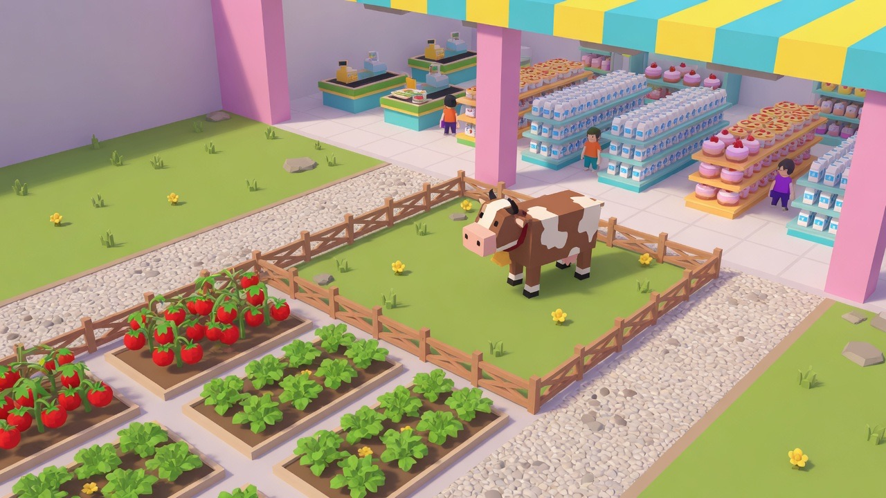

# Мой Супермаркет 3D

**▶️ Играть: https://sysrootix.github.io/supermarket-tycoon-3d/**

[Трейлер](assets/trailer.mp4) · внутри игры он открывается кнопкой ⚙️ → «🎬 Трейлер»



Симулятор супермаркета в браузере: выращиваешь товар на ферме, перерабатываешь в цехах,
выкладываешь на полки, пробиваешь покупателей на кассе и развиваешь магазин.
Настоящий 3D (three.js), день/ночь, персонал с ИИ, автосохранение, PWA.

## Запуск

**Двойной клик по `index.html`** — работает офлайн, без сборки и без интернета
(three.js лежит локально в `vendor/`).

Для PWA/установки на телефон нужен http(s):

```bash
python3 -m http.server 8000
# открыть http://localhost:8000
```

## Управление

| Действие | ПК | Телефон |
|---|---|---|
| Ходить | WASD / стрелки | джойстик слева |
| Камера | перетаскивание мышью, Q/E | перетаскивание |
| Зум | колесо | щипок |
| Магазин | `B` | кнопка «Магазин» |
| Закрыть | `Esc` | ✕ / свайп вниз |

Взаимодействие автоматическое: подошёл к грядке — забрал урожай, подошёл к полке —
выложил, встал за кассу — пробиваешь.

## Как устроена игра

```
огород / загон → рюкзак → цех переработки → полка → покупатель → касса → деньги
```

Карта разбита на четыре зоны, между постройками всегда есть проход в клетку —
подходишь и берёшь именно то, что нужно:

| Зона | Что там |
|---|---|
| 🌱 Огород | помидоры, огурцы, картофель, пшеница, яблони. Одинаковые грядки встают рядом |
| 🐄 Загон | куры, коровы, свиньи — за отдельным забором |
| 🍳 Цеха | салат-бар, пекарня, фритюрница, соковыжималка, сыроварня, гриль, кондитерская, пиццерия |
| 🏬 Зал | полки с ценниками, кассы, вход с тележками |

- **Подбор под контролем.** Товар снимается только с той постройки, у которой стоишь, а в узком
  проходе между двумя рядами решает направление взгляда — берёшь ту грядку, к которой повёрнут.
  Цель подбора подсвечена жёлтым кольцом заранее. Тап по рюкзаку открывает **🎯 что подбирать**:
  выключенный товар не попадёт в руки, даже если пробежать прямо по грядке (там же — «вытряхнуть рюкзак»).
- **Умный рюкзак.** Порядок не важен, и раскладывается всё сразу: встань в проходе с полным
  разным грузом — картошка уйдёт на полку с картошкой, мясо на свою, сыр займёт пустую,
  а помидор с огурцом заберёт стоящий рядом салат-бар. Забирают точно (только та грядка,
  у которой стоишь), выкладывают широко (соседние полки и цеха в радиусе).
- **Переработка кратно дороже:** мясо 42 ₽ → стейк 135 ₽, сыр+помидор+пшеница → пицца 430 ₽.
  Цех сам показывает табличкой, какого сырья ему не хватает.
- **Режимы грузчиков** (вкладка «Персонал»): общий для всех и свой у каждого — можно собрать конвейер.
  - 💎 *Максимум прибыли* — работает везде; держит полки наполненными, а излишки считает по деньгам:
    сравнивает цену на прилавке (**с учётом товара дня ×1.7**) с выручкой после переработки;
  - 🌱 *Участок: огород* — снимает урожай и везёт в цеха;
  - 🐄 *Участок: загон* — молоко, яйца, мясо в цеха;
  - 🍳 *Цеха → полки* — забирает готовое и уносит в зал;
  - 🗄️ *Всё на полки* — без переработки.

  Забитый цех разгружается первым (он простаивает), пустой зал важнее переработки.
  Рейс выбирается по деньгам с поправкой на весь маршрут (дойти + довезти), а если на своём
  участке работы нет — грузчик подстрахует остальных вместо простоя.
- **Покупатели** встают в очередь и теряют терпение; VIP берёт большую корзину и платит ×1.75.
  Часть бросает мусор — он роняет репутацию, убирай на бегу или найми уборщика.
- **Цены ставит игрок** (вкладка «💲 Цены»): наценка от ×0.6 до ×1.8. Дороже — выше маржа,
  но спрос падает, а выше ×1.35 часть покупателей уходит ни с чем и роняет репутацию.
- **Спрос по времени дня**: утром берут молоко, яйца, хлеб и яблоки; днём — овощи,
  салат, фри и стейк; вечером — торты, сок, сыр и пиццу. Ночью покупателей мало.
  Текущая категория видна в HUD, а во вкладке цен — спрос по каждому товару в процентах.
- **Порча товара**: у скоропортящегося есть срок (салат 80 с, фри 70 с, пицца 75 с,
  молоко 110 с; картошка и пшеница не портятся). Полоска над полкой показывает свежесть,
  просроченное уходит в мусор и снижает репутацию — заваливать полки впрок невыгодно.
- **Товар дня** — каждый день случайный товар продаётся ×1.7. В HUD он показан одной
  пилюлей вместе с текущим спросом (ночью там 🌙).
- **Заказы оптовиков** (карточка в HUD): раз в несколько минут приходит заявка вида
  «салат ×8 за 1312 ₽» с таймером 150 с. Выполняется сама, как только нужный товар
  оказывается на полках — прогресс виден в карточке. Просрочил — минус репутация.
- **Поставщики** (вкладка «🚚 Поставки») — страховка, а не лазейка: оптовик везёт **только сырьё**
  (готовое делай в цехах сам), а лот считается от текущей цены на полке ×1.25 + доставка,
  поэтому перепродать партию в лоб всегда убыточно — при любой наценке и даже в день ×1.7.
  Партия окупается только через переработку или закрытый заказ. Лот из 5 штук сначала уходит
  в цеха, которым сырья не хватает, остаток — на полки.
- **Воры**: часть посетителей уносит товар не заплатив (в тосте видно сумму убытка).
  Наёмный **охранник** ловит большинство — в тестах 8 краж без него против 3 с ним.
- **Панель проблем** (кнопка ⚠️ в HUD): пустые полки, забитые цеха, простой кассы,
  мусор, порча, нехватка сырья — со счётчиком и переходом камеры к месту по тапу.
- **Статистика** (⚙️ → «📊 Статистика»): выручка, продажи, средний чек, потери от порчи
  и краж, выполненные заказы.
- **Личный стиль магазина** (вкладка «🎨 Стиль»): своё название на вывеске
  (она перерисовывается сразу) и палитры стен, бордюра и пола.
- **Уровень магазина** растёт за сборы, выкладку и продажи; каждый уровень даёт деньги.
- **Офлайн-доход:** пока игра закрыта, смена (грузчик + кассир) работает, максимум 4 часа.
- **Апгрейды** трёх групп: себе (рюкзак, кроссовки), смене (тележки +3 к переносу, обувь +12% скорости,
  обучение −15% на операцию, оптимизация ФОТ −12% зарплат) и магазину (удобрения, стеллажи, сканер, реклама).
- **Мини-карта** справа: зоны, полки с цветом товара, кассы (зелёная — за ней стоят, красная — нет),
  персонал, покупатели и мусор.
- **65 заданий в 8 главах**: «Прилавок и грядка» → «Своя земля» → «Переработка» → «Живой уголок»
  → «Хозяин, а не грузчик» → «Оптовики и воры» → «Свой стиль» → «Сеть». Каждая глава открывает
  новый слой игры и объявляется отдельным окном; номер главы виден в карточке задания.
  Финал — сотый день и звание легенды района.
- **Музыка** — 20 тем, собранных на лету из аккордовых петель (файлов нет):
  «Утро на грядке», «Кассовый ритм», «Ночная смена», «Пиццерия» и другие.
  Каждый игровой день включается новая, ночью петля становится тише и спокойнее.
  Кнопка 🎵 в HUD выключает музыку, ⚙️ → «Другая музыка» переключает тему.
- **Мобильные раскладки** проверены авто-аудитом раскладки на 390×844, 320×568, 844×390 и 568×320:
  ни одна кнопка не мельче 32 px, ничего не уходит за край и элементы HUD не перекрывают друг друга.
  Стоя — пилюли в две строки, иконки отдельным рядом, мини-карта в потоке под HUD (налезть не может).
  Лёжа — HUD в одну строку с местом под мини-карту; на совсем низком экране мини-карта, звук,
  музыка и полный экран уезжают в меню ⚙️. Учтены вырезы экрана (safe-area), все окна
  закрываются тапом по фону.
- **PWA во весь экран**: манифест с `display: fullscreen`, кнопка ⛶ в HUD и переключатель
  ориентации в меню (авто / горизонтально / вертикально). При запуске с домашнего экрана
  игра сама разворачивается и ложится набок.
- **Рисованные текстуры** (`assets/`): трава, вспаханная земля огорода, плитка зала,
  бетон цехового двора и небо с облаками — сгенерированы и уложены поверх процедурных.
  Если файл не загрузился, остаётся процедурная текстура и игра работает как раньше.
- **Титульный экран** с артом, названием и кнопкой «Играть» (для сохранённой игры —
  «Продолжить» с днём, деньгами и уровнем). Он же первое касание игрока, после которого
  браузер разрешает музыку. Рядом — кнопки «Трейлер» и «Как играть».

## Когда участок застроен полностью

Слоты в зоне конечны (огород 20, загон 12, цеха 27, зал 32 полки и 4 кассы).
Если застроил всё одной культурой — это не тупик: кнопка **🗑️** в карточке сносит одну
постройку этого типа и возвращает **половину вложенного** (включая деньги за уровни),
освобождая место. Нажимать надо дважды — первое нажатие показывает сумму возврата.
Когда мест не осталось, развитие идёт **вглубь**: у каждой постройки есть уровни 1–6,
кнопка **«⬆ ур.»** в её карточке. Уровень ускоряет цикл на 18% и раз в два уровня
добавляет место под готовый товар; улучшается всегда самая отстающая постройка типа,
чтобы ряд рос ровно. Грядка помидоров на 6 уровне даёт урожай за 3.3 сек вместо 9.
Для зала тот же смысл несёт апгрейд «Стеллажи» (+2 к вместимости каждой полки).

## Производительность

- Качество выбирается автоматически (телефон/ПК) и снижается само, если кадры проседают;
  вручную — **⚙️ → «Качество»** (низкое / среднее / высокое).
- Геометрия, материалы и текстуры табличек кешируются; модели товаров клонируются из шаблона.
- Мелочь (товары, персонажи) не пишет в карту теней — вместо этого мягкое пятно под ногами.
- Всё, что дальше 15–19 клеток от камеры, не рисуется: на большой карте это режет вдвое число draw call.
- Логика кадра занимает ~0.5 мс — тормозить может только видеокарта, и на этот случай есть авто-качество.

## Сохранение

Прогресс терять нельзя, поэтому он пишется сразу в несколько мест:

- **два чередующихся слота** в localStorage — обрыв записи не убивает сейв,
  при загрузке берётся самый свежий целый;
- **зеркало в IndexedDB** — если localStorage вычистят (Safari делает это
  после недели без визитов, а на `*.github.io` соседний проект может вызвать
  `localStorage.clear()`), сейв восстановится оттуда автоматически;
- **`navigator.storage.persist()`** — просим у браузера постоянное хранилище;
- **ручной бэкап файлом**: ⚙️ → «Скачать бэкап» / «Загрузить бэкап».
  Так прогресс переносится на другое устройство или в другой браузер.

Автосохранение каждые 6 секунд и дополнительно при любой покупке, конце дня,
сворачивании вкладки и закрытии страницы (`pagehide` — на iOS `beforeunload` не срабатывает).
Все обращения к хранилищу обёрнуты в try/catch: в приватном окне игра не падает,
а в меню появляется предупреждение, что сохранение недоступно.

Сброс: **⚙️ → «Сбросить прогресс»** (нажать дважды).

## Файлы

| Файл | Что внутри |
|---|---|
| `data.js` | весь баланс и планировка: товары, цены, постройки, зоны и слоты, персонал, задания |
| `sim.js` | симуляция: сетка, поиск пути (BFS), ИИ покупателей и персонала, экономика, сейв |
| `models.js` | процедурные low-poly модели (ни одного внешнего ассета) |
| `scene.js` | сцена, свет, день/ночь, камера, анимации, летящие товары |
| `ui.js` | HUD, магазин, ввод, обучение |
| `audio.js` | звуки, синтезированные через WebAudio |
| `main.js` | игровой цикл и связка модулей |
| `sw.js`, `manifest.webmanifest` | офлайн-кэш и установка как приложение |

Симуляция полностью отделена от рендера: `sim.js` не знает про three.js и DOM,
общается с миром через очередь событий `G.ev`. Можно менять графику, не трогая логику.

## Балансировка

Всё в `data.js`:

- `ITEMS[x].price` — цена продажи;
- `DEF[x].cost / time` — цена постройки и время цикла (цена растёт ×1.3 за каждую следующую такую же);
- `DAY_LEN` — длительность игрового дня в секундах (180);
- `QUESTS` — цепочка заданий;
- `FIELD_SLOTS` / `PEN_SLOTS` / `WORK_SLOTS` / `SHELF_SLOTS` — планировка зон;
  постройка сама встаёт в свободный слот своей зоны рядом с такими же.

Сейв обратно совместим: старые сохранения подхватываются, постройки перекладываются
по новым зонам, недостающие поля берутся по умолчанию.

## Выложить как продукт

- **Веб / PWA:** залить папку на любой статик-хостинг (GitHub Pages, Netlify, Vercel).
  Манифест и service worker уже есть — игра ставится на домашний экран и работает офлайн.
  При обновлении файлов подними версию `CACHE` в `sw.js`.
- **App Store / Google Play:** обернуть в [Capacitor](https://capacitorjs.com):
  `npm i -D @capacitor/cli && npx cap init && npx cap add ios && npx cap copy` —
  папка проекта кладётся в `www/`. Для сторов понадобятся иконки в PNG
  (сейчас `icon.svg`), сплэш-экран и privacy policy (игра не собирает данные —
  всё в localStorage).
